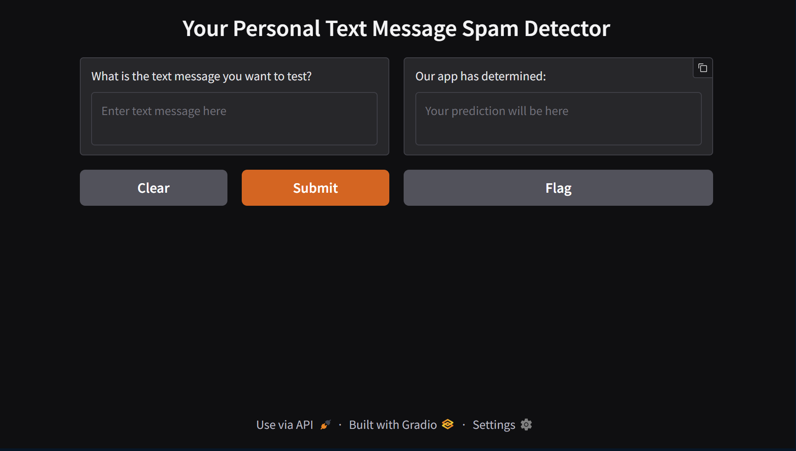

# SMS_Spam_Detector
Columbia AI Bootcamp Week 21 Module

### By Sami Chowdhury

## Background

This assignment focused on our ability to create a Linear SVC model that would classify if a text message was spam or not. It was trained on the data gathered in the *SMSSpamCollection.csv* file. We then created a Gradio app to host the application, enabling users to test text messages if they were spam or not. The application will provide feedback to users, indicating whether the text is classified as spam or not, based on the model's performance.

## Code Demonstration

To run the code, please run all the cells in the **gradio_sms_text_classification.ipynb** notebook. Ensure that you have the following libraries installed:

1. *pandas*
2. *sklearn*
3. *gradio*

## Image of the Gradio App Ran from the Code

Below is an example image of the Gradio app created from this project. A link will not be created and shared for personal security reasons. 



## Repository Structure

```
├── Images/
├──── example_gradio_sms_detector_app.png
├── Resources/
├──── SMSSpamCollection.csv
├── .gitignore
├── gradio_sms_text_classification.ipynb
├── README.md
```
